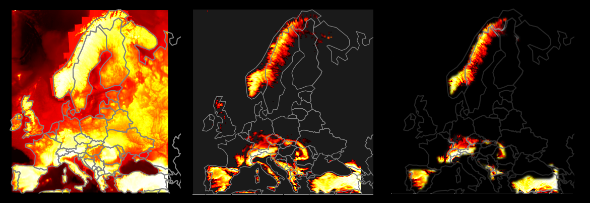

## Using mainly Spark and AWS finding areas in Europe with greater terrain elevation values than Europe's average elevation value and visualizing them on the map.

### **Dataset:** https://registry.opendata.aws/terrain-tiles/

### **Considered formats**
In available dataset there are a lot of different formats of data to choose from. They differently represent the information about elevation around the world.
Some of them are compressed, some encoded, they have different kind of coordinates mapping systems, some have metadata etc.  
Initialy I considered 2 formats: .HGT and .GeoTIFF.  

* .HGT contains raw elevation data in unprojected WGS84 (EPSG:4326) 1°x1° tiles. In short, after decoding from bytes to array using "big-endian" standard they become array of shape 3601x3601x1 and they contain elevation value in meters for every geographical second (thus 3601) in 1° latitude and longitude. On s3 bucket they are compressed in a gzip format and need to be decompressed after accessing with pyspark. Each file has size of 25MB

* .GeoTIFF format tiles are raw elevation data in Web Mercator projection (EPSG:3857). They are not compressed and contains very useful for us metadata - what area and coordinates (in Meters) each file (tile) covers on map. Using library rasterio I can easily access those metadas and array of raw values to operate on them, eg. calculate mean elevation value in each tile. They have much smaller size of ~40Kb.  Important is also the zoom system in this type of measurement: greater zoom corresponds to finer and more detailed measurements but exponentially more tiles to calculate. After couple of tries I concluded that zoom of 10 is sufficient for this project.  

Having considered the advantages I chose to use .GeoTIFF format.

### **AWS**
After logging to AWS console I created **EMR ( ElasticMapReduce )** cluster with **Hadoop and Spark** preinstalled on it. To avoid installing additional python libraries on every instance seperately I created bash script for it and appended it in EMR **bootstrap actions**, so it runs on every node after booting.

### **Data**
In selecting which range of tiles I need to download from s3 bucket in order to cover the europe I used this website:  
https://www.maptiler.com/google-maps-coordinates-tile-bounds-projection/

After selecting range of tiles, a function to generate s3 bucket paths to files is called.  
First program downloads first batch of tiles (here: 2000 in batch) and put them in RDD datastructure.
First RDD contains string representing bytes of .GeoTIFF format.  
Then function converting string to bytes is applied to every element of RDD creating new RDD.  
Then function which reads those bytes into **rasterio memory module** and returns raw value data is applied to every element.  
Function that reads metadatas containing coordinates of covered area is applied to every element creating new RDD with metadatas.  
On RDD containing raw elevation data, function calculating mean value is applied.  
Lastly, RDD with mean values and RDD with coordinates are zipped together, prepared for saving and saved in .csv format to our S3 bucket with current date and time.  This process is applied to every batch.

### **Visualization**
Having prepared csv files I could proceed to visualize this data.  
Using **boto3** module program downloads from my S3 bucket files and select those that meets the requirements, in this case all files that contains name "part" indicating that they are part of the whole data.  
Using **pandas** module program loads these .csv files and concatenate them together creating one dataframe.  Program sorts this dataframe by mean elevation value, selects minimum and maximum values and calculates mean elevation value in Europe.  
Thresholding of areas that has elevation less than europe's average is applied.  
Using custom functions and **wkt-loads modules** I change coordinates of each tiles to datatype that represents those coordinates in shape ( polygon ) form to plot them.  
Using **geopandas** I load contour map of whole earth with mapping system changed to the same used in our .GeoTIFF format. With geopandas and **matplotlib** I plot data in form of a heatmap and on top of that contours of european countries.  
From this image we can see important to us areas. Additionaly using openCV library this image can be smoothen and morphologicaly changed to extract big, main areas of interest. 

